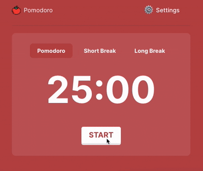

# Pomodoro Timer
This is a simple Pomodoro Timer web app built using React and Vite. You can try it out here: https://pomodoro-timer-pearl-delta.vercel.app/. The app enables users to seamlessly switch between Pomodoro, Short Break, and Long Break phases. The code was built with the help of GitHub Copilot. As a learning exercise, the UI/UX is implemented as closely as possible to [Pomofocus](https://pomofocus.io/).



## Features

- Pomodoro phase (default 25 minutes)
- Short Break phase (default 5 minutes)
- Long Break phase (default 15 minutes)
- Start/Pause functionality
- Next phase button
- Responsive design with a realistic button press effect

## Getting Started

Follow these steps to run the application locally:

### Prerequisites

- Node.js (version 14 or higher)
- npm or yarn

### Installation

1. Clone the repository:
   ```bash
   git clone <repository-url>
   cd <repository-directory>
   ```
2. Install dependencies

    ``` bash
    npm install
    # or
    yarn install
    ```
### Running this app
1. Start the development server:
``` bash
npm run dev
# or
yarn dev
```
2. Open your browser and navigate to http://localhost:PORT to see the application in action.
